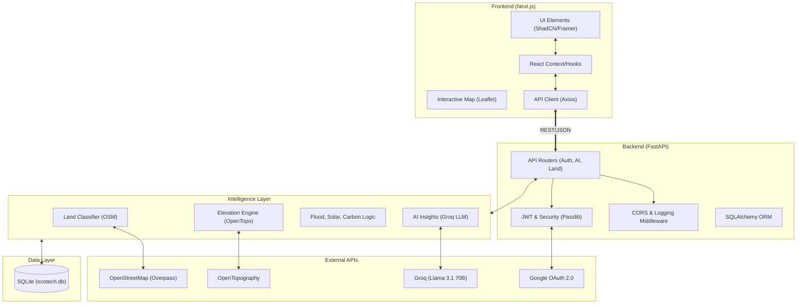

# EcoTech System Architecture

This document describes the high-level architecture and data flow of the EcoTech Ecosystem Valuation Engine.

## High-Level Flowchart

## System Components

### 1. Presentation Layer (Next.js)
- **Role**: Handles all user interactions, land selection (polygon drawing), and report visualization.
- **Key Tech**: Next.js, Tailwind CSS, Framer Motion, Leaflet.

### 2. Service Layer (FastAPI)
- **Role**: Secure API gateway that orchestrates calculations and handles user authentication.
- **Key Tech**: FastAPI, Pydantic, python-jose (JWT).

### 3. Intelligence Layer (Engines)
- **Land Engine**: Uses Overpass API to fetch real land-use data (forest, residential, etc).
- **Terrain Engine**: Fetches elevation and calculates slope via OpenTopography.
- **Valuation Engines**: Mathematical models for Solar ROI, Flood Risk, and Carbon Sequestration.
- **AI Engine**: Connects to Groq Llama 3 to generate strategic land-use recommendations.

### 4. Data Layer (SQLite)
- **Role**: Stores user credentials, project geometry, and cached analysis results.

---

## Architecture Image Generation Prompt

If you want to generate a high-quality visual representation using an AI image generator (like Midjourney, DALL-E, or Leonardo), use the following prompt:

> **Prompt:** 
> "A professional, highly detailed isometric system architecture flowchart for a modern tech platform called 'EcoTech'. The design features a futuristic, clean 3D aesthetic with tiered translucent glass platforms. Connectivity lines are neon green glowing circuits. Key modules: 1. Top platform 'Next.js Frontend' with a glowing map interface. 2. Middle platform 'FastAPI Microservices' with server rack icons. 3. 'Intelligence Layer' with icons for AI Brain, Leaf, and Solar Panels. 4. Bottom platform 'SQLite Storage' with a sleek cylinder icon. Floating satellites representing 'Google Auth', 'OpenStreetMap', and 'Groq AI' connect to the tiers. Cinematic lighting, 8k resolution, minimalist tech visualization style, depth of field."
